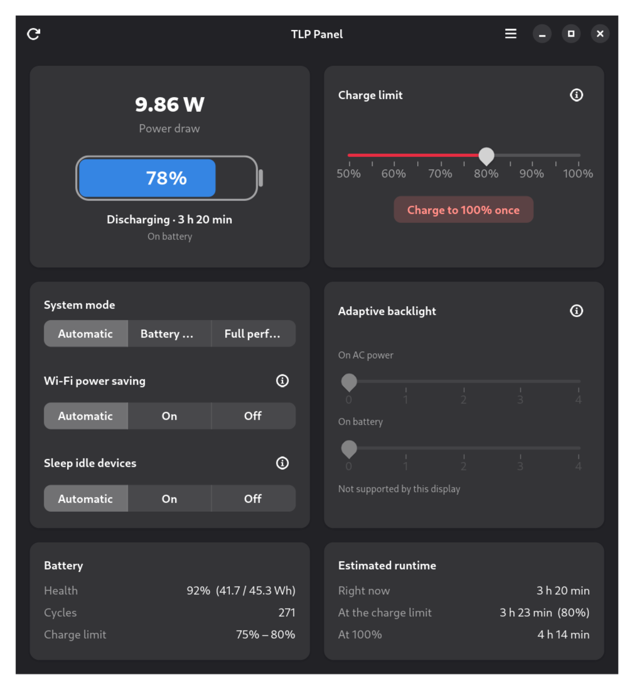

# TLP Panel

A GTK4 / libadwaita panel that shows what your laptop is doing with power right
now, and lets you drive [TLP](https://linrunner.de/tlp/) without a terminal.

TLP has no graphical interface of its own. The one that exists, TLPUI, is a
settings editor: it is good at the ~200 configuration options, but it does not
tell you your current draw, which profile is active, or how long the battery
will last. TLP Panel fills that gap — live readings on the left, the handful of
controls most people actually change on the right.



## What it shows

- **Live power draw in watts**, straight from the battery, refreshed every two
  seconds. While charging it reports charge power instead and says so, because
  the two are not the same number.
- **Charge, health and cycle count** — health as the current full capacity
  against the design capacity, so you can see how the pack has aged.
- **Estimated runtime** at the current draw: right now, at a full charge, and
  at your charge limit when one is set. While charging it counts down to the
  charge limit instead, since that is where the firmware will stop.

## What it changes

Every control writes to `/etc/tlp.d/90-tlp-panel.conf` and takes effect
immediately, so settings survive a reboot.

| Control | What it does |
|---|---|
| **System mode** | Automatic follows the power cable. Battery saving and Full performance pin one profile, and also apply the two settings below as a preset. |
| **Charge limit** | Stops charging at the chosen percentage. Written to the battery firmware. |
| **Charge to 100% once** | Ignores the limit for a single charge — for the day before a trip. |
| **Wi-Fi power saving** | Automatic sleeps the radio on battery only; On and Off force it either way. |
| **Sleep idle devices** | Whether idle PCI devices may power down. Per-device exemptions in your TLP config are left untouched. |
| **Adaptive backlight** | AMD panel power saving, 0–4, separately for AC and battery. |

The mode buttons are a preset: pressing one also sets Wi-Fi power saving and
device sleep to match, in a single authorisation. You can then adjust either of
them on their own — the preset is a starting point, not a lock.

## Honest about hardware

Some knobs exist in sysfs but do nothing on a given machine, which is worse
than not having them at all. TLP Panel checks and tells you:

- **Adaptive backlight** runs on the display microcontroller. On several AMD
  APUs (Picasso among them) that firmware is never loaded, so the kernel
  accepts a level, stores it, and nothing changes. The panel detects this and
  marks the section unsupported rather than pretending.
- **Charge limits** only appear when the battery actually exposes thresholds.
- **Wi-Fi and device sleep** only appear when there is something to control.

## Requirements

- TLP 1.4 or newer
- GTK 4 and libadwaita 1.4+
- Python 3.9+ with PyGObject
- polkit, for the four privileged actions

On Debian 13 / Ubuntu 24.04 and newer:

```sh
sudo apt install tlp python3-gi gir1.2-gtk-4.0 gir1.2-adw-1 polkitd
```

## Install

### From a .deb

```sh
sudo apt install ./tlp-panel_0.2.2_all.deb
```

### From source

```sh
git clone https://github.com/timemrah/tlp-panel.git
cd tlp-panel
sudo make install
```

Launch **TLP Panel** from your application grid, or run `tlp-panel`.

To try it without installing: `make run`. To remove it: `sudo make uninstall`.

### Building the .deb yourself

```sh
sudo apt install debhelper
dpkg-buildpackage -us -uc -b
```

## How it works

The window runs as your user and never as root. Everything it displays comes
from files any user can read:

| Value | Source |
|---|---|
| Draw, charge, health, cycles, thresholds | `/sys/class/power_supply/BAT*` |
| Mains state | `/sys/class/power_supply/*/online` where `type` is `Mains` |
| Active profile | `/run/tlp/last_pwr` (`0` = AC, `1` = battery) |
| Forced profile | `/run/tlp/manual_mode` (`0` = AC, `1` = battery, `n` = auto) |
| Effective TLP settings | `/run/tlp/run.conf` |
| Adaptive backlight support | `/var/lib/tlp-panel/abm-supported` |

Batteries that report charge in µAh instead of energy in µWh are converted
using the reported voltage, so machines without `power_now` still show watts.

Changes go through `pkexec` to `/usr/libexec/tlp-panel-helper`, a shell script
that accepts a fixed set of verbs with strictly validated arguments and writes
only keys from a known allowlist. It never passes an argument to a shell. Two
polkit actions cover it, both `auth_admin_keep`, so a run of adjustments asks
for your password once.

After writing a key the helper re-runs TLP, which both applies the setting and
regenerates `/run/tlp/run.conf` — the file the panel reads back. It re-runs the
mode that is currently active, so a manually pinned profile stays pinned.

## Translating

The interface follows your locale. English is the source language; Turkish
ships with it. Adding a language means adding one dictionary to
`src/tlppanel/i18n.py` — there are no catalogues to compile.

`make check` fails when a translatable string has no entry, so a language
cannot silently rot. The checker parses the source with `ast`, which catches
implicitly concatenated multi-line strings that a grep would miss.

## Licence

GPL-3.0-or-later. TLP is a separate project by Thomas Koch, licensed GPL-2.0+;
this panel only calls its command-line interface.
